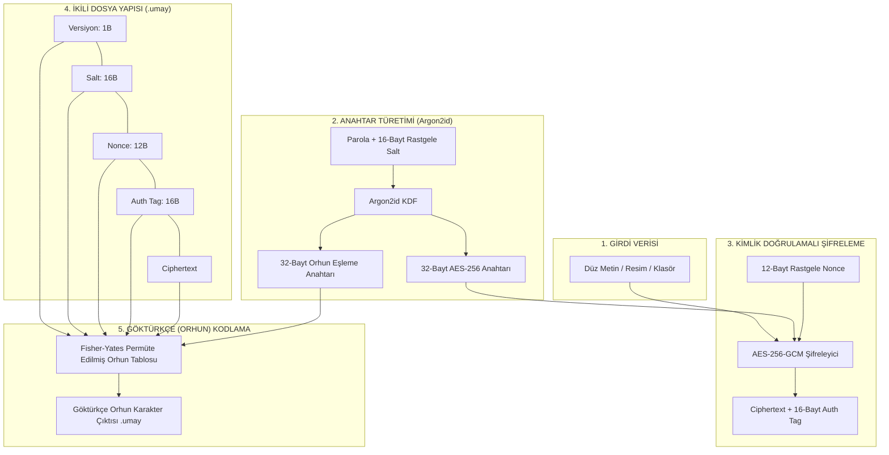

<div align="center">

  

$${\color{lightblue}\text{# UMAY ANA}\space\text{𐰶𐰼𐰃𐰯𐱃𐰆}}$$
  ### *UmayCrypt — Umay Ana'nın Koruması Altında Veri Şifreleme*
  `𐰆𐰢𐰖 𐰀𐰣𐰀 𐰶𐰼𐰃𐰯𐱃𐰆 — 𐰋𐰀𐰼𐰃 𐱁𐰃𐰯𐰼𐰀𐰞𐰀𐰢𐰀 𐰀𐰺𐰀𐰲𐰃`

  [Türkçe](README.md) | [English](README_EN.md)

  [](https://www.python.org/)
  [](LICENSE)
  [](https://owasp.org/)

</div>

---

**UmayCrypt**, Türk mitolojisindeki koruyucu tanrıça **Umay Ana**'nın ruhundan ilham alan, gerçek kriptografik güvenliğini **AES-256-GCM** ve **Argon2id** algoritmalarından alan, Göktürk (Orhun-Yenisey) alfabesi motifiyle zenginleştirilmiş komut satırı şifreleme aracıdır.

---

## 🏛️ Mitolojik Arka Plan: Umay Ana Kimdir?

Eski Türk mitolojisinde ve inancında **Umay Ana**, çocukları, kadınları, evleri ve tüm canlıların soyunu kötü niyetli ruhlardan ve görünmez tehlikelerden koruyan ana tanrıçadır. **UmayCrypt**, bu koruyucu felsefeyi dijital çağa taşır: Verilerinizi "kötü niyetli gözlerden ve yetkisiz erişimlerden" korumak için yüksek kriptografik zırhla mühürler.

---

## 🔒 Mimari ve Kriptografik Güvenlik

> [!IMPORTANT]
> **Göktürkçe (Orhun) Katmanının Rolü ve Sınırları:**
> - Göktürkçe alfabesi katmanı, şifrelenmiş bayt verilerinin üzerine eklenmiş bir **Görünüm ve İkincil Gizleme (Obfuscation)** katmanıdır.
> - Bu katman tek başına bir şifreleme algoritması **DEĞİLDİR** ve AES-256-GCM'in sağladığı gerçek matematiksel güvenliği **asla azaltmaz veya zayıflatmaz**.
> - Gerçek kriptografik gizlilik, bütünlük ve doğrulama **AES-256-GCM** ve **Argon2id** algoritmaları tarafından garanti edilmektedir.



---

## Neden AES-256-GCM ve Argon2id?

1. **AES-256-GCM (Authenticated Encryption):**
   - **Galois/Counter Mode (GCM)**, hem veri gizliliğini hem de bütünlüğünü (Integrity & Authenticity) aynı anda sağlar.
   - Herhangi bir veri kurcalanması veya yanlış parola girilmesi durumunda 16-baytlık (128-bit) `auth_tag` doğrulaması anında başarısız olur ve deşifreleme durdurulur.

2. **Argon2id (Paroladan Anahtar Türetimi):**
   - OWASP önerilerine tam uygun parametrelerle yapılandırılmıştır:
     - **Bellek Zorluğu (`memory_cost`):** `65536 KiB` (64 MiB) — GPU/ASIC kaba kuvvet (brute-force) saldırılarına karşı koruma sağlar.
     - **Zaman Zorluğu (`time_cost`):** `3` iterasyon.
     - **Paralellik (`parallelism`):** `4` iş parçacığı.
   - Her dosya için 16-baytlık benzersiz cryptographically-secure rastgele `salt` türetilir.

3. **Parolaya Bağlı Orhun Eşleme Katmanı:**
   - Unicode Old Turkic bloğundaki (`U+10C00–U+10C25`) 38 temel Orhun harfi kullanılır.
   - Argon2id çıktısının ikinci yarısı (`mapping_key`) ile **Fisher-Yates permütasyonu** yapılarak her parola için benzersiz bir bayt $\rightarrow$ Orhun-çifti eşleme tablosu oluşturulur.
   - Her bayt 2 nibble'a (4-bit üst + 4-bit alt) bölünerek 2 Orhun harfine dönüştürülür.

---

## 📦 Kurulum

```bash
# Depoyu klonlayın
git clone https://github.com/umaycrypt/umaycrypt.git
cd umaycrypt

# Gerekli bağımlılıkları yükleyin
pip install -r requirements.txt

# Geliştirici modunda kurun (umay CLI komutunu aktif eder)
pip install -e .
```

---

## Kullanım ve CLI Komutları

UmayCrypt varsayılan olarak parolayı `getpass` ile güvenli şekilde ister. Parola terminalde görüntülenmez ve geçmişe kaydedilmez.

### 1. Dosya veya Resim Şifreleme
Düz metin veya resim (`.png`, `.jpg`, `.bmp`) dosyalarını bayt seviyesinde şifreler:

```bash
umay encrypt --input resim.png --output resim.png.umay
```

### 2. Klasör Şifreleme (Toplu İşleme)
Bir klasörü içeriğiyle birlikte özyinelemeli olarak paketler ve şifreler:

```bash
umay encrypt --input ./gizli_klasor --output gizli_klasor.umay
```

### 3. Deşifre Etme (.umay Çözme)
Şifrelenmiş `.umay` dosyasını veya klasörünü orijinal haline getirir:

```bash
umay decrypt --input resim.png.umay --output resim_cozulen.png
umay decrypt --input gizli_klasor.umay --output ./gizli_klasor_cozulen
```

### 4. Metin Şifreleme (Terminal Çıktısı)
Metni doğrudan terminale Orhun alfabesiyle basar:

```bash
umay encrypt-text --message "Umay Ana verilerimizi korusun!"
# Çıktı: 𐰉𐰥𐰊𐰕𐰌𐰢𐰉𐰣𐰟𐰕𐰄𐰒𐰄𐰣𐰗𐰣𐰇𐰠𐰔𐰞𐰌𐰞𐰔𐰣𐰏𐰣...
```

### 5. Metin Deşifre Etme
Göktürkçe harflerden oluşan metni çözer:

```bash
umay decrypt-text --message "𐰉𐰥𐰊𐰕𐰌𐰢𐰉..."
```

---

## Testlerin Çalıştırılması

Tüm kriptografik işlevler, bozuk dosya senaryoları, yanlış parola durumları ve Orhun permütasyon doğrulamaları `pytest` ile test edilebilir:

```bash
pytest -v
```

---

## 📜 Lisans

Bu proje **MIT Lisansı** altında sunulmaktadır.
