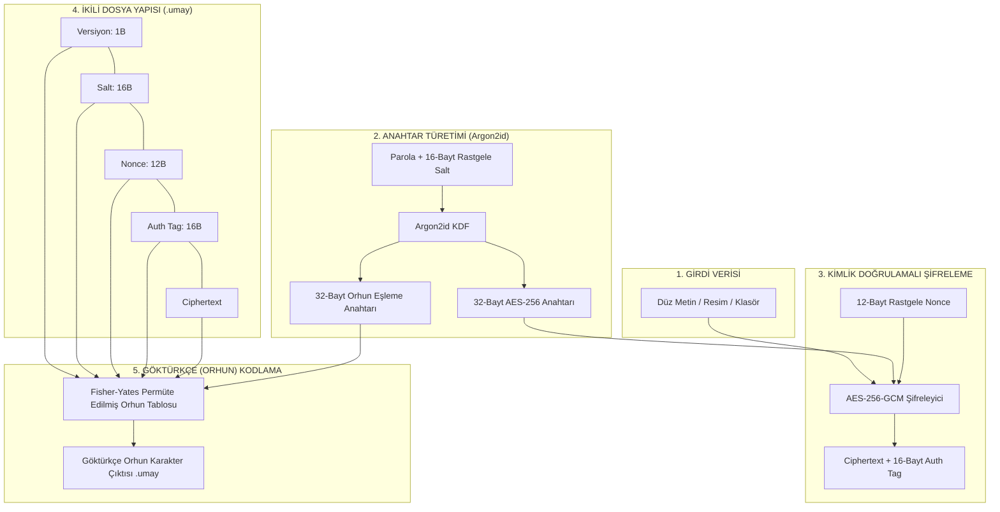

<div align="center">

  

  # UMAY ANA 𐰶𐰼𐰃𐰯𐱃𐰆
  ### *UmayCrypt — Umay Ana'nın Koruması Altında Veri Şifreleme*
  `𐰆𐰢𐰖 𐰀𐰣𐰀 𐰶𐰼𐰃𐰯𐱃𐰆 — 𐰋𐰀𐰼𐰃 𐱁𐰃𐰯𐰼𐰀𐰞𐰀𐰢𐰀 𐰀𐰺𐰀𐰲𐰃`

  [Türkçe](README.md) | [English](README_EN.md)

  [](https://www.python.org/)
  [](LICENSE)
  [](https://owasp.org/)

</div>

---

**UmayCrypt**, Türk mitolojisindeki koruyucu ruh **Umay Ana**'dan ilham alan, gerçek kriptografik güvenliğini **AES-256-GCM** ve **Argon2id** algoritmalarından alan, Göktürk (Orhun-Yenisey) alfabesi motifiyle zenginleştirilmiş komut satırı şifreleme aracıdır.

---

## 🏛️ Mitolojik Arka Plan: Umay Ana Kimdir?

Eski Türk mitolojisinde ve inancında **Umay Ana**, çocukları, kadınları, evleri ve tüm canlıların soyunu kötü niyetli ruhlardan ve görünmez tehlikelerden koruyan kutsal koruyucu ruhtur. **UmayCrypt**, bu koruyucu felsefeyi dijital çağa taşır: Verilerinizi "kötü niyetli gözlerden ve yetkisiz erişimlerden" korumak için yüksek kriptografik zırhla mühürler.

---

## 🔒 Mimari ve Kriptografik Güvenlik

> [!IMPORTANT]
> **Göktürkçe (Orhun) Katmanının Rolü ve Sınırları:**
> - Göktürkçe alfabesi katmanı, şifrelenmiş bayt verilerinin üzerine eklenmiş bir **Görünüm ve İkincil Gizleme (Obfuscation)** katmanıdır.
> - Bu katman tek başına bir şifreleme algoritması **DEĞİLDİR** ve AES-256-GCM'in sağladığı gerçek matematiksel güvenliği **asla azaltmaz veya zayıflatmaz**.
> - Gerçek kriptografik gizlilik, bütünlük ve doğrulama **AES-256-GCM** ve **Argon2id** algoritmaları tarafından garanti edilmektedir.



---

## Neden AES-256-GCM ve Argon2id?

1. **AES-256-GCM (Authenticated Encryption):**
   - **Galois/Counter Mode (GCM)**, hem veri gizliliğini hem de bütünlüğünü (Integrity & Authenticity) aynı anda sağlar.
   - Herhangi bir veri kurcalanması veya yanlış parola girilmesi durumunda 16-baytlık (128-bit) `auth_tag` doğrulaması anında başarısız olur ve deşifreleme durdurulur.

2. **Argon2id (Paroladan Anahtar Türetimi):**
   - OWASP önerilerine tam uygun parametrelerle yapılandırılmıştır:
     - **Bellek Zorluğu (`memory_cost`):** `65536 KiB` (64 MiB) — GPU/ASIC kaba kuvvet (brute-force) saldırılarına karşı koruma sağlar.
     - **Zaman Zorluğu (`time_cost`):** `3` iterasyon.
     - **Paralellik (`parallelism`):** `4` iş parçacığı.
   - Her dosya için 16-baytlık benzersiz cryptographically-secure rastgele `salt` türetilir.

3. **Parolaya Bağlı Orhun Eşleme Katmanı:**
   - Unicode Old Turkic bloğundaki (`U+10C00–U+10C25`) 38 temel Orhun harfi kullanılır.
   - Argon2id çıktısının ikinci yarısı (`mapping_key`) ile **Fisher-Yates permütasyonu** yapılarak her parola için benzersiz bir bayt $\rightarrow$ Orhun-çifti eşleme tablosu oluşturulur.
   - Her bayt 2 nibble'a (4-bit üst + 4-bit alt) bölünerek 2 Orhun harfine dönüştürülür.

---

## 📦 Kurulum

### macOS (Global / Homebrew Kurulumu):
```bash
# Depoyu klonlayın
git clone https://github.com/gorkemguler/umaycrypt.git
cd umaycrypt

# macOS terminalinde 'umay' komutunu aktif edin
python3 -m pip install --break-system-packages -e .

# Test edin
umay --help
```

### Sanal Ortam (venv) ile Kurulum:
```bash
python3 -m venv venv
source venv/bin/activate
pip install -e .
```

---

## ⌨️ Tab Tamamlama (Tab Completion) Kurulumu

Terminalinizde `umay` yazıp **Tab** tuşuna bastığınızda komutların (`encrypt`, `decrypt` vb.), parametrelerin ve dosya yollarının otomatik tamamlanmasını sağlayabilirsiniz:

### macOS / zsh için (Tek Komutla Aktif Etme):
```bash
echo 'eval "$(register-python-argcomplete umay)"' >> ~/.zshrc && source ~/.zshrc
```

### bash için:
```bash
echo 'eval "$(register-python-argcomplete umay)"' >> ~/.bashrc && source ~/.bashrc
```

> **İpucu:** Kurulum rehberini dilediğiniz zaman `umay completion` komutuyla da görüntüleyebilirsiniz.

---

## Kullanım ve CLI Komutları

UmayCrypt varsayılan olarak parolayı `getpass` ile güvenli şekilde ister. Parola terminalde görüntülenmez ve geçmişe kaydedilmez.

### 1. Dosya veya Resim Şifreleme
Düz metin veya resim (`.png`, `.jpg`, `.bmp`) dosyalarını bayt seviyesinde şifreler:

```bash
umay encrypt --input resim.png --output resim.png.umay
```

### 2. Klasör Şifreleme (Toplu İşleme)
Bir klasörü içeriğiyle birlikte özyinelemeli olarak paketler ve şifreler:

```bash
umay encrypt --input ./gizli_klasor --output gizli_klasor.umay
```

### 3. Deşifre Etme (.umay Çözme)
Şifrelenmiş `.umay` dosyasını veya klasörünü orijinal haline getirir:

```bash
umay decrypt --input resim.png.umay --output resim_cozulen.png
umay decrypt --input gizli_klasor.umay --output ./gizli_klasor_cozulen
```

### 4. Metin Şifreleme (Terminal Çıktısı)
Metni doğrudan terminale Orhun alfabesiyle basar:

```bash
umay encrypt-text --message 'Umay Ana verilerimizi korusun!'
# Çıktı: 𐰉𐰥𐰊𐰕𐰌𐰢𐰉𐰣𐰟𐰕𐰄𐰒𐰄𐰣𐰗𐰣𐰇𐰠𐰔𐰞𐰌𐰞𐰔𐰣𐰏𐰣...
```

> [!TIP]
> **zsh / macOS Terminal İpucu:** İçinde ünlem işareti (`!`) veya özel karakter bulunan metinlerde zsh kabuğunun `dquote>` moduna geçmesini önlemek için metinleri her zaman **tek tırnak (`'...'`)** içine alın.

### 5. Metin Deşifre Etme
Göktürkçe harflerden oluşan metni çözer:

```bash
umay decrypt-text '𐰉𐰥𐰊𐰕𐰌𐰢𐰉...'
```

---

## 🖥️ Terminal Ekran Görüntüleri ve Örnek Çalıştırmalar

Aşağıda **UmayCrypt** komut satırı aracının farklı senaryolardaki gerçek terminal çalıştırma çıktıları yer almaktadır:

### 1. UmayCrypt Başlığı ve Yardım Menüsü (`umay --help`)

```text
user@macbook ~ % umay

 _   _ __  __    _   \ \ / /  ____ ____  \ \ / / ____ _____ 
| | | |  \/  |  / \   \ V /  / ___|  _ \  \ V /|  _ \_   _|
| | | | |\/| | / _ \   | |  | |   | |_) |  | | | |_) || |  
| |_| | |  | |/ ___ \  | |  | |___|  _ <   | | |  __/ | |  
 \___/|_|  |_/_/   \_\ |_|   \____|_| \_\  |_| |_|    |_|  
    --- Umay Ana'nın Koruması Altında Veri Şifreleme ---

usage: umay [-h] {encrypt,decrypt,encrypt-text,decrypt-text} ...

UmayCrypt - Göktürk (Orhun-Yenisey) Motifli AES-256-GCM Şifreleme Aracı

positional arguments:
  {encrypt,decrypt,encrypt-text,decrypt-text}
                        Kullanılabilir komutlar
    encrypt             Dosya veya klasör şifreleme (.umay üretir)
    decrypt             Şifreli .umay dosyasını veya klasörünü deşifre etme
    encrypt-text        Düz metni şifreleyip terminale Orhun harfleriyle basma
    decrypt-text        Orhun harfli metni deşifre edip terminale basma
```

### 2. Düz Metni Göktürkçeye Şifreleme (`umay encrypt-text`)

```text
user@macbook ~ % umay encrypt-text 'Umay Ana verilerimizi korusun!'
🛡️  Anahtar Parolanızı Girin: 
🛡️  Parolanızı Tekrar Girin: 

𐰎𐰌𐰥𐰙𐰛𐰌𐰐𐰊𐰃𐰗𐰡𐰀𐰍𐰚𐰍𐰝𐰒𐰊𐰍𐰊𐰜𐰕𐰛𐰊𐰞𐰇𐰜𐰚𐰃𐰉𐰛𐰗𐰞𐰏𐰕𐰐𐰢𐰛𐰞𐰐𐰜𐰈𐰢𐰤𐰚𐰇𐰆𐰁𐰓𐰇𐰔𐰙𐰌𐰐𐰚𐰟𐰢𐰗𐰕𐰤𐰆𐰟𐰜𐰃𐰆𐰝𐰕𐰟𐰄𐰤𐰆𐰙𐰚𐰃𐰒𐰐𐰉𐰍𐰚𐰇𐰑𐰟𐰆𐰠𐰞𐰋𐰓𐰤𐰌𐰠𐰑𐰛𐰔𐰠𐰣𐰈𐰣𐰗𐰓𐰛𐰜𐰡𐰕𐰁𐰊𐰋𐰜𐰡𐰊𐰍𐰓𐰇𐰔𐰇𐰚𐰁𐰚𐰛𐰔𐰃𐰕𐰀𐰚𐰃𐰂𐰡𐰕𐰡𐰂𐰡𐰌𐰀𐰑𐰛𐰜𐰁𐰕𐰛𐰆𐰝𐰢𐰤𐰂𐰝𐰉𐰈𐰌𐰀𐰞𐰡
```

### 3. Göktürkçe Metni Deşifre Etme (`umay decrypt-text`)

```text
user@macbook ~ % umay decrypt-text '𐰎𐰌𐰥𐰙𐰛𐰌𐰐𐰊𐰃𐰗𐰡𐰀𐰍𐰚𐰍𐰝𐰒𐰊𐰍𐰊𐰜𐰕𐰛𐰊𐰞𐰇𐰜...'
🛡️  Anahtar Parolanızı Girin: 

Umay Ana verilerimizi korusun!
```

### 4. Dosya Şifreleme (`umay encrypt`)

```text
user@macbook ~ % umay encrypt --input resim.png --output resim.png.umay
🛡️  Anahtar Parolanızı Girin: 
🛡️  Parolanızı Tekrar Girin: 

📄 Dosya okunuyor: resim.png
🔐 AES-256-GCM + Argon2id ile şifreleniyor & Orhun motifine işleniyor...
✨ Başarılı! Veri Umay Ana'nın koruması altında mühürlendi.
📁 Çıktı Dosyası: resim.png.umay
```

### 5. Şifreli Dosyayı Deşifre Etme (`umay decrypt`)

```text
user@macbook ~ % umay decrypt --input resim.png.umay --output resim_cozulen.png
🛡️  Anahtar Parolanızı Girin: 

🔓 Orhun harfleri çözümleniyor & AES-256-GCM auth_tag doğrulanıyor...
✨ Başarılı! Umay Ana'nın mühürü açıldı. Dosya oluşturuldu: resim_cozulen.png
```

### 6. Toplu Klasör Şifreleme ve Çıkarma (`umay encrypt` & `umay decrypt`)

```text
user@macbook ~ % umay encrypt --input ./gizli_klasor --output gizli_klasor.umay
🛡️  Anahtar Parolanızı Girin: 
🛡️  Parolanızı Tekrar Girin: 

📦 Klasör arşivleniyor: ./gizli_klasor
🔐 AES-256-GCM + Argon2id ile şifreleniyor & Orhun motifine işleniyor...
✨ Başarılı! Veri Umay Ana'nın koruması altında mühürlendi.
📁 Çıktı Dosyası: gizli_klasor.umay

user@macbook ~ % umay decrypt --input gizli_klasor.umay --output ./klasor_cozulen
🛡️  Anahtar Parolanızı Girin: 

🔓 Orhun harfleri çözümleniyor & AES-256-GCM auth_tag doğrulanıyor...
📂 Klasör arşivi ayıklanıyor: ./klasor_cozulen
✨ Başarılı! Umay Ana'nın mühürü açıldı. Klasör çıkarıldı: ./klasor_cozulen
```

---

## Testlerin Çalıştırılması

Tüm kriptografik işlevler, bozuk dosya senaryoları, yanlış parola durumları ve Orhun permütasyon doğrulamaları `pytest` ile test edilebilir:

```bash
pytest -v
```

---

## 📜 Lisans

Bu proje **MIT Lisansı** altında sunulmaktadır.
