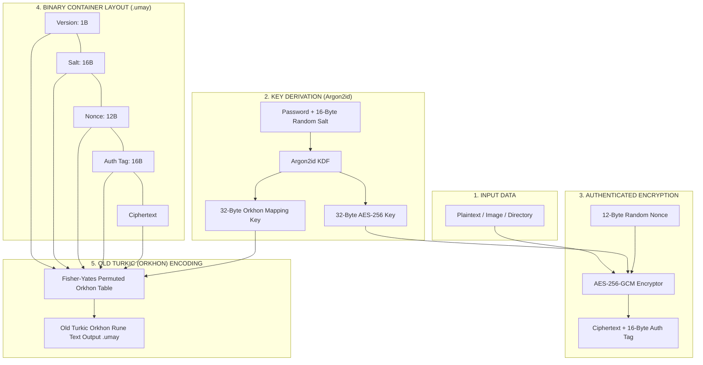

<div align="center">

  

  # UMAY ANA 𐰶𐰼𐰃𐰯𐱃𐰆
  ### *UmayCrypt — Data Encryption under the Protection of Goddess Umay*
  `𐰆𐰢𐰖 𐰀𐰣𐰀 𐰶𐰼𐰃𐰯𐱃𐰆 — 𐰋𐰀𐰼𐰃 𐱁𐰃𐰯𐰼𐰀𐰞𐰀𐰢𐰀 𐰀𐰺𐰀𐰲𐰃`

  [Türkçe](README.md) | [English](README_EN.md)

  [](https://www.python.org/)
  [](LICENSE)
  [](https://owasp.org/)

</div>

---

**UmayCrypt** is a Command Line (CLI) encryption tool inspired by **Umay Ana**, the protective goddess in Turkic mythology. It relies on **AES-256-GCM** and **Argon2id** for genuine cryptographic security, enriched with a visual and obfuscation layer formatted in Old Turkic (Orkhon-Yenisei) runes.

---

## 🏛️ Mythological Background: Who is Umay Ana?

In ancient Turkic mythology and beliefs, **Umay Ana** (Mother Umay) is the divine mother goddess who protects children, women, homes, and all living creatures from evil spirits and unseen threats. **UmayCrypt** brings this ancient protective philosophy into the digital age: sealing your sensitive data under a cryptographic armor to shield it from malicious eyes and unauthorized access.

---

## 🔒 Architecture & Cryptographic Security

> [!IMPORTANT]
> **Role & Boundaries of the Old Turkic (Orkhon) Mapping Layer:**
> - The Old Turkic rune layer is an added **Presentation & Obfuscation** layer over the encrypted byte payload.
> - It is **NOT** a standalone encryption algorithm and **DOES NOT** reduce or weaken the mathematical security provided by AES-256-GCM.
> - True cryptographic privacy, integrity, and authentication are strictly guaranteed by **AES-256-GCM** and **Argon2id**.



---

## 🛠️ Why AES-256-GCM & Argon2id?

1. **AES-256-GCM (Authenticated Encryption):**
   - **Galois/Counter Mode (GCM)** ensures both data confidentiality and authenticity/integrity simultaneously.
   - Any tampering or incorrect password causes the 16-byte (128-bit) `auth_tag` verification to immediately fail and abort decryption.

2. **Argon2id (Key Derivation Function):**
   - Configured strictly according to OWASP recommendations:
     - **Memory Cost (`memory_cost`):** `65536 KiB` (64 MiB) — provides high resistance against GPU/ASIC brute-force attacks.
     - **Time Cost (`time_cost`):** `3` iterations.
     - **Parallelism (`parallelism`):** `4` threads.
   - Generates a unique 16-byte cryptographically secure random `salt` for every encryption session.

3. **Password-Dependent Orkhon Mapping Layer:**
   - Uses 38 canonical Old Turkic runes from the Unicode Old Turkic block (`U+10C00–U+10C25`).
   - The second half of the Argon2id output (`mapping_key`) seeds a **Fisher-Yates shuffle** to produce a unique byte $\rightarrow$ Orkhon rune-pair table for every password.
   - Each byte is split into 2 nibbles (4-bit high + 4-bit low) and encoded into 2 Orkhon runes.

---

## 📦 Installation

```bash
# Clone the repository
git clone https://github.com/umaycrypt/umaycrypt.git
cd umaycrypt

# Install required dependencies
pip install -r requirements.txt

# Install package in editable mode (activates the umay CLI binary)
pip install -e .
```

---

## 🚀 Usage & CLI Commands

By default, UmayCrypt securely prompts for passwords using `getpass`. Passwords are never echoed to stdout or stored in history.

### 1. File or Image Encryption
Encrypt plain text or image files (`.png`, `.jpg`, `.bmp`) at byte level:

```bash
umay encrypt --input photo.png --output photo.png.umay
```

### 2. Directory Encryption (Batch Processing)
Recursively packages and encrypts an entire folder:

```bash
umay encrypt --input ./secret_folder --output secret_folder.umay
```

### 3. Decryption (Unlocking .umay)
Decrypts `.umay` files or folders back to their original form:

```bash
umay decrypt --input photo.png.umay --output restored_photo.png
umay decrypt --input secret_folder.umay --output ./restored_folder
```

### 4. Text Encryption (Terminal Output)
Encrypts text and prints directly to the terminal in Orkhon runes:

```bash
umay encrypt-text --message "May Umay Ana protect our data!"
# Output: 𐰉𐰥𐰊𐰕𐰌𐰢𐰉𐰣𐰟𐰕𐰄𐰒𐰄𐰣𐰗𐰣𐰇𐰠𐰔𐰞𐰌𐰞𐰔𐰣𐰏𐰣...
```

### 5. Text Decryption
Decrypts text written in Orkhon runes back to plaintext:

```bash
umay decrypt-text --message "𐰉𐰥𐰊𐰕𐰌𐰢𐰉..."
```

---

## 🧪 Running Tests

All cryptographic primitives, corrupted file scenarios, wrong password conditions, and Orkhon permutation logic can be verified using `pytest`:

```bash
pytest -v
```

---

## 📜 License

This project is licensed under the **MIT License**.
