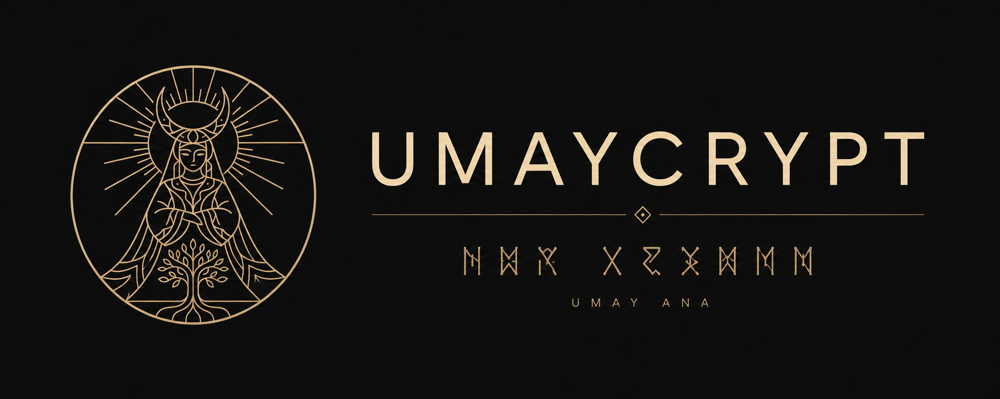
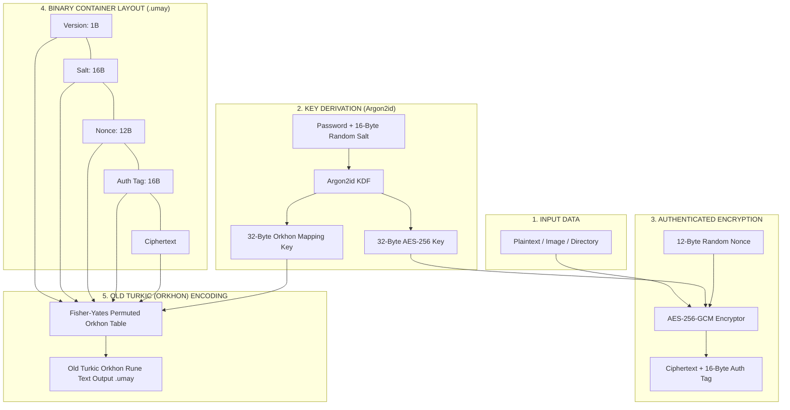

<div align="center">

  

  # UMAY ANA 𐰶𐰼𐰃𐰯𐱃𐰆
  ### *UmayCrypt — Data Encryption under the Protection of Guardian Spirit Umay*
  `𐰆𐰢𐰖 𐰀𐰣𐰀 𐰶𐰼𐰃𐰯𐱃𐰆 — 𐰋𐰀𐰼𐰃 𐱁𐰃𐰯𐰼𐰀𐰞𐰀𐰢𐰀 𐰀𐰺𐰀𐰲𐰃`

  [Türkçe](README.md) | [English](README_EN.md)

  [](https://www.python.org/)
  [](LICENSE)
  [](https://owasp.org/)

</div>

---

**UmayCrypt** is a Command Line (CLI) encryption tool inspired by **Umay Ana**, the protective guardian spirit in Turkic mythology. It relies on **AES-256-GCM** and **Argon2id** for genuine cryptographic security, enriched with a visual and obfuscation layer formatted in Old Turkic (Orkhon-Yenisei) runes.

---

## 🏛️ Mythological Background: Who is Umay Ana?

In ancient Turkic mythology and beliefs, **Umay Ana** (Mother Umay) is the sacred guardian spirit who protects children, women, homes, and all living creatures from evil spirits and unseen threats. **UmayCrypt** brings this ancient protective philosophy into the digital age: sealing your sensitive data under a cryptographic armor to shield it from malicious eyes and unauthorized access.

---

## 🔒 Architecture & Cryptographic Security

> [!IMPORTANT]
> **Role & Boundaries of the Old Turkic (Orkhon) Mapping Layer:**
> - The Old Turkic rune layer is an added **Presentation & Obfuscation** layer over the encrypted byte payload.
> - It is **NOT** a standalone encryption algorithm and **DOES NOT** reduce or weaken the mathematical security provided by AES-256-GCM.
> - True cryptographic privacy, integrity, and authentication are strictly guaranteed by **AES-256-GCM** and **Argon2id**.



---

## Why AES-256-GCM & Argon2id?

1. **AES-256-GCM (Authenticated Encryption):**
   - **Galois/Counter Mode (GCM)** ensures both data confidentiality and authenticity/integrity simultaneously.
   - Any tampering or incorrect password causes the 16-byte (128-bit) `auth_tag` verification to immediately fail and abort decryption.

2. **Argon2id (Key Derivation Function):**
   - Configured strictly according to OWASP recommendations:
     - **Memory Cost (`memory_cost`):** `65536 KiB` (64 MiB) — provides high resistance against GPU/ASIC brute-force attacks.
     - **Time Cost (`time_cost`):** `3` iterations.
     - **Parallelism (`parallelism`):** `4` threads.
   - Generates a unique 16-byte cryptographically secure random `salt` for every encryption session.

3. **Password-Dependent Orkhon Mapping Layer:**
   - Uses 38 canonical Old Turkic runes from the Unicode Old Turkic block (`U+10C00–U+10C25`).
   - The second half of the Argon2id output (`mapping_key`) seeds a **Fisher-Yates shuffle** to produce a unique byte $\rightarrow$ Orkhon rune-pair table for every password.
   - Each byte is split into 2 nibbles (4-bit high + 4-bit low) and encoded into 2 Orkhon runes.

---

## 📦 Installation

### macOS (Global / Homebrew Installation):
```bash
# Clone the repository
git clone https://github.com/gorkemguler/umaycrypt.git
cd umaycrypt

# Enable the 'umay' command directly on macOS terminal
python3 -m pip install --break-system-packages -e .

# Test execution
umay --help
```

### Virtual Environment (venv) Installation:
```bash
python3 -m venv venv
source venv/bin/activate
pip install -e .
```

---

## ⌨️ Shell Tab Completion Setup

You can enable auto-completion for `umay` subcommands (`encrypt`, `decrypt`, etc.), flags, and file paths when pressing the **Tab** key:

### For macOS / zsh (One-Line Activation):
```bash
echo -e '\nautoload -U compinit && compinit -u\neval "$(register-python-argcomplete umay)"' >> ~/.zshrc && source ~/.zshrc
```

### For bash:
```bash
echo 'eval "$(register-python-argcomplete umay)"' >> ~/.bashrc && source ~/.bashrc
```

> **Tip:** You can view these instructions anytime by running `umay completion`.

---

## Usage & CLI Commands

By default, UmayCrypt securely prompts for passwords using `getpass`. Passwords are never echoed to stdout or stored in history.

### 1. File or Image Encryption
Encrypt plain text or image files (`.png`, `.jpg`, `.bmp`) at byte level:

```bash
umay encrypt --input photo.png --output photo.png.umay
```

### 2. Directory Encryption (Batch Processing)
Recursively packages and encrypts an entire folder:

```bash
umay encrypt --input ./secret_folder --output secret_folder.umay
```

### 3. Decryption (Unlocking .umay)
Decrypts `.umay` files or folders back to their original form:

```bash
umay decrypt --input photo.png.umay --output restored_photo.png
umay decrypt --input secret_folder.umay --output ./restored_folder
```

### 4. Text Encryption (Terminal Output)
Encrypts text and prints directly to the terminal in Orkhon runes:

```bash
umay encrypt-text --message 'May Umay Ana protect our data!'
# Output: 𐰉𐰥𐰊𐰕𐰌𐰢𐰉𐰣𐰟𐰕𐰄𐰒𐰄𐰣𐰗𐰣𐰇𐰠𐰔𐰞𐰌𐰞𐰔𐰣𐰏𐰣...
```

> [!TIP]
> **zsh / macOS Terminal Tip:** When passing messages containing exclamation marks (`!`) or special characters, always enclose your string in **single quotes (`'...'`)** to prevent zsh history expansion (`dquote>` prompt).

### 5. Text Decryption
Decrypts text written in Orkhon runes back to plaintext:

```bash
umay decrypt-text '𐰉𐰥𐰊𐰕𐰌𐰢𐰉...'
```

---

## 🖥️ Terminal Output Demonstrations

Below are actual terminal execution logs of **UmayCrypt** across various usage scenarios:

### 1. Banner Header & Help Menu (`umay --help`)

```text
user@macbook ~ % umay

 _   _ __  __    _   \ \ / /  ____ ____  \ \ / / ____ _____ 
| | | |  \/  |  / \   \ V /  / ___|  _ \  \ V /|  _ \_   _|
| | | | |\/| | / _ \   | |  | |   | |_) |  | | | |_) || |  
| |_| | |  | |/ ___ \  | |  | |___|  _ <   | | |  __/ | |  
 \___/|_|  |_/_/   \_\ |_|   \____|_| \_\  |_| |_|    |_|  
    --- Umay Ana'nın Koruması Altında Veri Şifreleme ---

usage: umay [-h] {encrypt,decrypt,encrypt-text,decrypt-text} ...

UmayCrypt - Göktürk (Orhun-Yenisey) Motifli AES-256-GCM Şifreleme Aracı

positional arguments:
  {encrypt,decrypt,encrypt-text,decrypt-text}
                        Kullanılabilir komutlar
    encrypt             Dosya veya klasör şifreleme (.umay üretir)
    decrypt             Şifreli .umay dosyasını veya klasörünü deşifre etme
    encrypt-text        Düz metni şifreleyip terminale Orhun harfleriyle basma
    decrypt-text        Orhun harfli metni deşifre edip terminale basma
```

### 2. Encrypting Plaintext to Orkhon Runes (`umay encrypt-text`)

```text
user@macbook ~ % umay encrypt-text 'May Umay Ana protect our data!'
🛡️  Enter Key Password: 
🛡️  Confirm Key Password: 

𐰎𐰌𐰥𐰙𐰛𐰌𐰐𐰊𐰃𐰗𐰡𐰀𐰍𐰚𐰍𐰝𐰒𐰊𐰍𐰊𐰜𐰕𐰛𐰊𐰞𐰇𐰜𐰚𐰃𐰉𐰛𐰗𐰞𐰏𐰕𐰐𐰢𐰛𐰞𐰐𐰜𐰈𐰢𐰤𐰚𐰇𐰆𐰁𐰓𐰇𐰔𐰙𐰌𐰐𐰚𐰟𐰢𐰗𐰕𐰤𐰆𐰟𐰜𐰃𐰆𐰝𐰕𐰟𐰄𐰤𐰆𐰙𐰚𐰃𐰒𐰐𐰉𐰍𐰚𐰇𐰑𐰟𐰆𐰠𐰞𐰋𐰓𐰤𐰌𐰠𐰑𐰛𐰔𐰠𐰣𐰈𐰣𐰗𐰓𐰛𐰜𐰡𐰕𐰁𐰊𐰋𐰜𐰡𐰊𐰍𐰓𐰇𐰔𐰇𐰚𐰁𐰚𐰛𐰔𐰃𐰕𐰀𐰚𐰃𐰂𐰡𐰕𐰡𐰂𐰡𐰌𐰀𐰑𐰛𐰜𐰁𐰕𐰛𐰆𐰝𐰢𐰤𐰂𐰝𐰉𐰈𐰌𐰀𐰞𐰡
```

### 3. Decrypting Orkhon Runes to Plaintext (`umay decrypt-text`)

```text
user@macbook ~ % umay decrypt-text '𐰎𐰌𐰥𐰙𐰛𐰌𐰐𐰊𐰃𐰗𐰡𐰀𐰍𐰚𐰍𐰝𐰒𐰊𐰍𐰊𐰜𐰕𐰛𐰊𐰞𐰇𐰜...'
🛡️  Enter Key Password: 

May Umay Ana protect our data!
```

### 4. Encrypting a File (`umay encrypt`)

```text
user@macbook ~ % umay encrypt --input photo.png --output photo.png.umay
🛡️  Enter Key Password: 
🛡️  Confirm Key Password: 

📄 Reading file: photo.png
🔐 Encrypting with AES-256-GCM + Argon2id & encoding to Orkhon runes...
✨ Success! Data sealed under the protection of Umay Ana.
📁 Output file: photo.png.umay
```

### 5. Decrypting an Encrypted File (`umay decrypt`)

```text
user@macbook ~ % umay decrypt --input photo.png.umay --output photo_restored.png
🛡️  Enter Key Password: 

🔓 Decoding Orkhon runes & verifying AES-256-GCM auth_tag...
✨ Success! Umay Ana's seal unsealed. Created file: photo_restored.png
```

### 6. Folder Batch Encryption & Extraction (`umay encrypt` & `umay decrypt`)

```text
user@macbook ~ % umay encrypt --input ./secret_folder --output secret_folder.umay
🛡️  Enter Key Password: 
🛡️  Confirm Key Password: 

📦 Archiving folder: ./secret_folder
🔐 Encrypting with AES-256-GCM + Argon2id & encoding to Orkhon runes...
✨ Success! Data sealed under the protection of Umay Ana.
📁 Output file: secret_folder.umay

user@macbook ~ % umay decrypt --input secret_folder.umay --output ./extracted_folder
🛡️  Enter Key Password: 

🔓 Decoding Orkhon runes & verifying AES-256-GCM auth_tag...
📂 Unpacking folder archive: ./extracted_folder
✨ Success! Umay Ana's seal unsealed. Extracted directory: ./extracted_folder
```

---

## Running Tests

All cryptographic primitives, corrupted file scenarios, wrong password conditions, and Orkhon permutation logic can be verified using `pytest`:

```bash
pytest -v
```

---

## 📜 License

This project is licensed under the **MIT License**.
